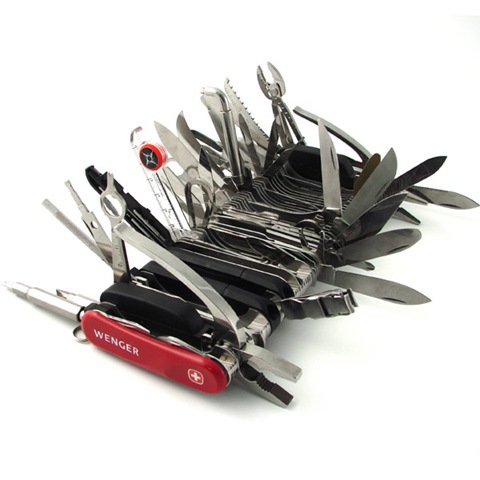
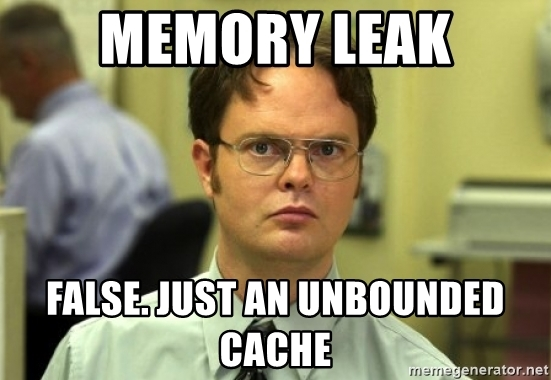

name: routes_and_optimizations
class: middle, center

# Interactive Front-end Development

## Urmas Talimaa
## _Glia Inc_

???

<!-- Dummy notes to check presenter display  -->

Presenter display slide notes

Pre-lecture checklist

* Switching between mirroring and non-mirroring works
* Unrelated tabs and windows closed or minimized
* Do not disturb mode **ON**
* Slides cloned, one has presenters mode on
* Dependencies installed and scripts are working for lecture example code
* Terminal(s) open with code and window to run scripts

---


# Front end bugs

I tried to use feature X, but when I clicked on the button, nothing happens.

I tried this several times, nothing happens at all. Also feature Y is not working at the same time.

--

Bugs happen in machines that are not under your control.

Customers are unable to clearly describe problems.

???

Product manager approaches the developer responsible for the user interface and
asks to investigate and fix the problem.

You, the developer, go digging into the user interface and backend logs. The
logs are hard to parse (as is usual), no bugs can be identified from the logs.
Using feature X works both locally and in the production environment, bug is
not reproducible.

A lot of time wasted trying to reproduce the issue, no idea what and how to
fix. Developers are unhappy Product managers are unhappy Customers are unhappy

---

# Front end bugs


---

# Front end bugs

* You are responsible for fixing the bugs
* You are responsible for gathering debug data

---

# Front end bugs

Solution?

* Add a bug reporting button to your application
* Customer arrives at erroneous application state and clicks button
* Current state and interaction history is submitted to your server
* Capturing state and action history is very easy in a reducer-based application

---

# Front end bugs

* The order of user interface transitions that surfaced the bug can be analyzed
* With a little bit of tooling it is possible to "play through" what the user
  experienced and "time travel" to the exact moment when a problem occurred
* The bug might be in the user interface, but might also be in the back end or
  anywhere in between instead.

---

# Front end bugs
 
* Hard to catch race conditions are the bane of developers
* Action history is a complete, ordered, emotion-free representation of what
  happened

---

# Front end bugs


---

# Where to display all the views?


.footer[_from [https://lostechies.com/gabrielschenker/2009/01/21/real-swiss-don-t-need-srp-do-they/](https://lostechies.com/gabrielschenker/2009/01/21/real-swiss-don-t-need-srp-do-they/)_]

---

# Multi-Page Single Page Application

* Cannot pack all functionality in a single always-visible page
* Could render different views when application is in different states
  * Create actions to navigate the app
  * Show certain views based on current navigation state

---

# Linking

.left-half[
* Friend wants to open the same "page" that I'm on
* Disappointment when friend lands to the landing view
]

.right-half[]

---

# URL

Traditional web pages have had this solved from the beginning

---

# History API

* [https://developer.mozilla.org/en-US/docs/Web/API/History_API](https://developer.mozilla.org/en-US/docs/Web/API/History_API)
* `push` new URL and title to history - effectively navigating
* `replace` current URL and title
* `go` back/forward n steps
* `popstate` event for listening to changes

---

# History API

* Have different URLs for different UI screens
* Use links (and automatic navigation) to navigate through screens
* Open appropriate screen when URL pasted to browser

---

# React Router

* Every framework has its own routing mechanism that builds on top of the history API
* [https://reacttraining.com/react-router/](https://reacttraining.com/react-router/)
* Declarative routing
* Variables in routes are passed to components as props
  * Component with route `/user/:userId` can use `props.match.params.userId`
  * Alternatively, hooks can be used

---

# React Router

[Code example](https://github.com/urmastalimaa/interactive-frontend-development/blob/master/lecture_7/src/router-basics/README.md)

---
  
# What not to do with URLs

* Do not implement wizards with different routes
* Each route must make sense on its own without requiring a specific status of some process in state
* A user must be able to come back to a URL at a later time and the URL should still make sense

---

# What not to do with URLs

```js
  dispatch(stepThreeCompleted());
  dispatch(push('/stepFour'));
```

* In what order should these actions be dispatched?
* What component should be shown in between them?
* One interaction = one action
* "/stepFour" is nonsensical when the form has been completed

???

One interaction = one action rule is broken sometimes, but only for a good reason

---

# Optimization

* [General information and tips](https://reactjs.org/docs/optimizing-performance.html)
* Optimization is not required for medium sized React (-Redux) applications
* Simple optimizations are available due to the nature of application

---

# Optimization

* How much of the comment app is re-rendered when changing the list filter?
* How much actually has to be re-rendered?
* One of the simplest ways to optimize is to cut down on renders
* React Dev Tools Profiler
* `console.count(label)`

---

# Optimization

* React [`shouldComponentUpdate(nextProps,
  nextState)`](https://reactjs.org/docs/react-component.html#shouldcomponentupdate)
  stops render tree and caches previous result if false returned
* [React.memo](https://reactjs.org/docs/react-api.html#reactmemo) implements
  `shouldComponentUpdate` as shallow comparison
* All child components must also be pure
* Props nor state objects cannot be mutated!

---

# Caching

.full-image[]

---

# Optimization

* Selector functions are pure functions and create new objects
* A new, non-primitive object is never shallow-equal to any other object
* `useMemo()`
* `useCallback()`

---

# Caching

.full-image[]

---

# Object/Function cache

React hooks provide very simple caches

* Size 1
* Invalidates by shallow comparison of arguments
* Discarded when component is unmounted

---

# Object/Function cache

* Missing any dependency in the dependencies list causes extremely hard-to-catch bugs!
* `dispatch`/`setState` and similar functions from React are guaranteed "stable" across renders

---

# Homework

* [Requirements](https://github.com/urmastalimaa/interactive-frontend-development/blob/master/homework/mathemagician/exercise7.md)
* Deadline Sunday 16/05/2021 23:59
* Submit zipped file to https://courses.cs.ut.ee/2021/react/Main/Submit
* **Only submit what is yours**
